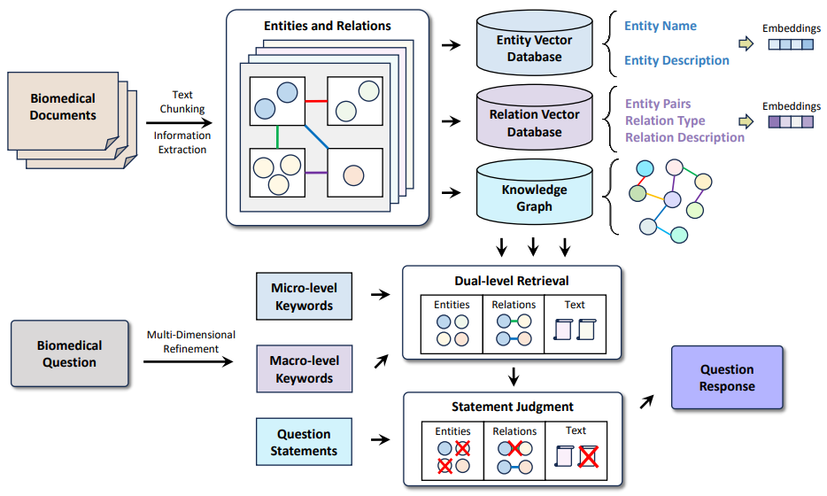

# KGSRAG
## Overview
This study addresses critical challenges in biomedical information retrieval and reasoning, aiming to achieve efficient and precise knowledge discovery and deep information mining from vast biomedical data. Our system tackles domain knowledge updates through real-time knowledge graphs, resolves inefficient retrieval via fine-grained entity and relation matching and a three-tier filtering mechanism, and effectively mitigates hallucinations through rigorous claim-level verification. This enables precise information localization while minimizing contextual noise.


Code for [xiv](https://)

## Dataset
The [BioASQ-QA](https://pmc.ncbi.nlm.nih.gov/articles/PMC10042099/pdf/41597_2023_Article_2068.pdf) dataset can be downloaded following the instructions at [here](https://participants-area.bioasq.org/datasets/). 
The [PubMedQA](https://aclanthology.org/D19-1259.pdf) dataset can be downloaded following the instructions at [here](https://pubmedqa.github.io/). 
Several samples have been added to the data folder (`./data/BioASQ-QA/` and `./data/PubMedQA/`)

The expected structure of dataset files is:
```
KGSRAG
 |-- data
 |    |-- BioASQ-QA
 |    |    |-- 12B1_golden.json
 |    |    |-- 12B2_golden.json
 |    |    |-- 12B3_golden.json
 |    |    |-- 12B4_golden.json
 |    |-- PubMedQA
 |    |    |-- ori_pqaa.json
 |    |    |-- ori_pqal.json
 |    |    |-- ori_pqau.json
 |    |-- bioasq_corpus.json
 |    |-- bioasq_qa.json
 |    |-- pubmedqa_corpus.json
 |    |-- pubmed_qa.json
```

## Environment
```
conda create -n KGSRAG python=3.9.20
conda activate KGSRAG
pip install -r requirements.txt
```

## Preprocessing Data
Before preprocessing the data, you need to download the dataset to the corresponding location, as shown in the data file format above.
```
python ./preprocess/pre_bioasq.py
python ./preprocess/pre_pubmedqa.py
```

## Information Extraction
This process will extract information from the given corpus and build a knowledge base and knowledge graph.
```
bash ./script/information_extraction.sh
```

## Question Extraction
This process will extract macro-level and micro-level keywords from the question, generate statements based on the question, and store them.
```
bash ./script/question_decomposition.sh
```

## Answer Generation
This process will use the knowledge graph to retrieve information based on the question, macro-level keywords, and micro-level keywords. It will make judgments based on the question statements, focus on key information, and finally generate responses.
```
bash script/generate_answer.sh
```

## Evaluation
This process will evaluate the response results. The evaluation method of BioASQ-QA is revised from [here](https://github.com/BioASQ/Evaluation-Measures). The summary of the evaluation results is reported in the ./output/evaluation folder.
```
bash script/evaluate_bioasq.sh
bash script/evaluate_pubmedqa.sh
```
